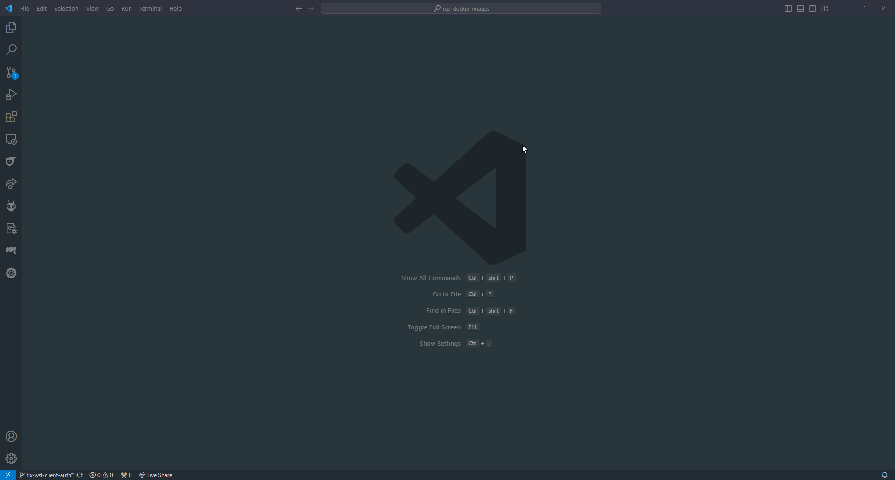

# Meditron RCP connection tutorial

## 1. Pre-setup (access to scratch and cluster)

Please ask Alexandre to add you to the corresponding groups. You can check your groups at https://groups.epfl.ch/

## 2. Setting-up credentials

This part makes sure that you have access to [GitHub](https://github.com), [wandb](https://wandb.ai/) and [huggingface](https://huggingface.co/) from the cluster. If it's not already done, create an account on those platforms!
To setup the credentials, we must access the scratch in `haas001.rcp.epfl.ch` using ssh. The password is your GASPAR credentials:
```bash
ssh $GASPAR@haas001.rcp.epfl.ch
```
**For this part, every command will be done from the ssh terminal**

Go in the scratch directory (`/mnt/mlo/scratch`):
```bash
# SSH terminal

cd /mnt/light/scratch/users
mkdir $GASPAR
```

### WANDB and HuggingFace credentials

We will store the API keys within our directory in a folder that only our user will have access to. Both the wandb and Hugging Face API keys will be stored in a .txt file within this protected folder.

```bash
# SSH terminal

cd /mnt/light/scratch/users/$GASPAR_USER
mkdir keys
cd keys
touch hf_key.txt
touch wandb_key.txt
chmod 700 -R ../keys/
```
* For Huggingface: you can create a new access token at https://huggingface.co/settings/tokens. Put this token in the file `hf_key.txt`
* For WANDB: you can access your tokens at https://wandb.ai/settings. Scroll down to "API keys". Put this token in the file `wandb_key.txt`

### Github credentials

To carry out the automatic login to GitHub, we will need to store our git identification (.gitconfig) and our access credentials (.git-credentials), which in this case we will do using a Personal Access Token.

To do this, we will need to set the environment variable `$HOME` to the personal folder we have created and activate the credential helper that will store our access credentials.
```bash
# SSH terminal

export HOME=/mnt/light/scratch/users/$GASPAR_USER
git config --global credential.helper store
```

Then we will configure our git identification, specifying a username and email address.
```bash
# SSH terminal

git config --global user.name "GITHUB_USERNAME"
git config --global user.email "MY_NAME@example.com"
```

Create a [Personal access token](https://github.com/settings/tokens). Select `Generate new token` and the `classic` option. Give every permissions to this token.

Finally, we will execute an action that requires our identification on GitHub to enter our access credentials and store them (e.g. Clone a private repository). When prompted for the password, we will enter the Personal Access Token that we created:
```bash
# SSH terminal

git clone https://github.com/OpenMeditron/MultiMeditron.git
```
If you were able to clone the repo, then your setup is correct.


### Remote VSCode configuration

We will store the configurations related to VSCode in a folder in the scratch volume so that we don't have to download them every time we start a new container.
```bash
# SSH terminal

mkdir /mnt/light/scratch/users/$GASPAR_USER/.vscode-server
```


## 3. Setup runai and kubectl on your machine

> [!IMPORTANT]
The setup below was tested on macOS with Apple Silicon. If you are using a different system, you may need to adapt the commands. For Windows, we have no experience with the setup and thereby recommend WSL (Windows Subsystem for Linux) to run the commands. If you choose WSL, you should choose the commands as if you were running Linux.

1. Install kubectl

```bash
# Your terminal (either WSL, Linux or Mac)

curl -LO "https://dl.k8s.io/release/v1.29.6/bin/darwin/arm64/kubectl"
# Linux: curl -LO "https://dl.k8s.io/release/v1.29.6/bin/linux/amd64/kubectl"

# Give it the right permissions and move it.
chmod +x ./kubectl
sudo mv ./kubectl /usr/local/bin/kubectl
sudo chown root: /usr/local/bin/kubectl
```

2. Setup the kube config file: Take our template file [kubeconfig.yaml](https://github.com/epfml/getting-started/blob/main/kubeconfig.yaml) as your config in the home folder ~/.kube/config. Note that the file on your machine has no suffix.

```bash
# Your terminal

mkdir ~/.kube/
curl -o  ~/.kube/config https://raw.githubusercontent.com/epfml/getting-started/main/kubeconfig.yaml
```

3. Install the run:ai CLI for RCP (two RCP clusters):

```bash
# Your terminal

# Download the CLI from the link shown in the help section.
# for Linux: replace `darwin` with `linux`
wget --content-disposition https://rcp-caas-prod.rcp.epfl.ch/cli/darwin
# Give it the right permissions and move it.
chmod +x ./runai
sudo mv ./runai /usr/local/bin/runai
sudo chown root: /usr/local/bin/runai
```

## 4. Login

The RCP is organized into a [3 level hierarchy](https://wiki.rcp.epfl.ch/en/home/CaaS/FAQ/how-to-use-runai#access-hierarchy). The department is the laboratory (e.g. LIGHT or MLO). The projects determine which scratch (aka persistent storage) we have access to <sup>[1](#myfootnote1)</sup>. Note that you should choose the SSO option when executing `runai login`.


```bash
# Your terminal

runai config cluster rcp-caas
runai login
runai list project
runai config project light-$GASPAR
```

## 5. Submit a job

Time to test if we can submit a job! This command will allocate 1 GPU from the cluster and "sleep" to infinity (meaning that it will do essentially nothing) 

```bash
# Your terminal

runai submit \
  --name meditron-basic \
  --image registry.rcp.epfl.ch/multimeditron/basic:latest-$GASPAR\
  --pvc light-scratch:/mloscratch \
  --large-shm \
  -e NAS_HOME=/mloscratch/users/$GASPAR \
  -e HF_API_KEY_FILE_AT=/mloscratch/users/$GASPAR/keys/hf_key.txt \
  -e WANDB_API_KEY_FILE_AT=/mloscratch/users/$GASPAR/keys/wandb_key.txt \
  -e GITCONFIG_AT=/mloscratch/users/$GASPAR/.gitconfig \
  -e GIT_CREDENTIALS_AT=/mloscratch/users/$GASPAR/.git-credentials \
  -e VSCODE_CONFIG_AT=/mloscratch/users/$GASPAR/.vscode-server \
  --backoff-limit 0 \
  --run-as-gid 84257 \
  --node-pool h100 \
  --gpu 1 \
  -- sleep infinity
```

Explanation:
* `name` is the name of the job
* `image` is the link to the docker image that will be attached to the cluster
* `pvc` determines which scratch will be mounted to the job. The argument is of the form: `name_of_the_scratch:/mount/path/to/scratch`. Here the we are mounting the scratch named `light-scratch` to the local path `/mloscratch` **This is part may cause an error because of the LIGHT migration** 
* `gpu` is the number of GPU that you want to claim for this job (larger amount of GPU will be harder to get as ressources are limited)

We can check the outputs of our container and the status of the job using the following commands respectively.
```bash
# Your terminal

runai logs meditron-basic
runai describe job meditron-basic
```

To end a job, run the command:
```bash
# Your terminal

runai delete job meditron-basic
```

You can access your job by doing
```bash
# Your terminal

runai bash meditron-basic
```
You should see a terminal opening. Enter the following command in your new terminal to ensure that you have indeed a GPU: 
```bash
# Job terminal

nvidia-smi
```

Once you are done, run the following command to delete the job:
```bash
# Your terminal

runai delete job meditron-basic
```

## 6. VSCode connection

### Mac and Linux

Once we have the container running on a node of the RCP cluster, we can attach to it in VSCode. To do this, we need to have the following extensions installed:
* [Kubernetes](https://marketplace.visualstudio.com/items?itemName=ms-kubernetes-tools.vscode-kubernetes-tools)
* [Dev containers](https://marketplace.visualstudio.com/items?itemName=ms-vscode-remote.remote-containers)

From the Kubernetes menu, we can see the IC and the RCP Cluster. We will enter the menu of the RCP Cluster -> Workloads -> Pods and we will see our container with a green indicator showing that it is running. Right-clicking on it will give us the option to "Attach to Visual Studio". Upon clicking, the editor will open in a new window within the container. When opening a new terminal, we will find ourselves directly in our personal folder. We can install new extensions, and they will be saved for future sessions.

### Windows (WSL connection)

For WSL setup, you will need [kubernetes](https://kubernetes.io/docs/tasks/tools/install-kubectl-windows/) on your Windows host because VSCode is going to look for it on the host (and not in WSL).

In **Windows terminal** (not WSL), run:

```bash
# Windows terminal

curl.exe -LO "https://dl.k8s.io/release/v1.32.0/bin/windows/amd64/kubectl.exe"
```

Create a folder `~/.kube` in Windows:
```bash
# Windows terminal

mkdir ~/.kube/
```


In **WSL**, claim a job and copy the kube configuration file from WSL to Windows
```
# WSL terminal

runai submit \
  --name meditron-basic \
  --image registry.rcp.epfl.ch/multimeditron/basic:latest-$GASPAR\
  --pvc light-scratch:/mloscratch \
  --large-shm \
  -e NAS_HOME=/mloscratch/users/$GASPAR \
  -e HF_API_KEY_FILE_AT=/mloscratch/users/$GASPAR/keys/hf_key.txt \
  -e WANDB_API_KEY_FILE_AT=/mloscratch/users/$GASPAR/keys/wandb_key.txt \
  -e GITCONFIG_AT=/mloscratch/users/$GASPAR/.gitconfig \
  -e GIT_CREDENTIALS_AT=/mloscratch/users/$GASPAR/.git-credentials \
  -e VSCODE_CONFIG_AT=/mloscratch/users/$GASPAR/.vscode-server \
  --backoff-limit 0 \
  --run-as-gid 84257 \
  --node-pool h100 \
  --gpu 1 \
  -- sleep infinity

cp ~/.kube/config /mnt/c/Users/$WINDOWS_USERNAME/.kube/config
```

Open VSCode. Install this extension: https://marketplace.visualstudio.com/items?itemName=mtsmfm.vscode-k8s-quick-attach. 

To attach VSCode to your job:
Go to View -> Command Palette (or Ctrl+Shift+P), search for "k8s quick attach: Quick attach k8s Pod" -> rcp-caas -> runai-mlo-GASPAR -> meditron-basic-0-0 -> /mloscratch/users/$GASPAR_USER.

#### VSCode Troubleshooting

If you encounter the following error:


Run:
```bash
# WSL terminal

runai login
cp ~/.kube/config /mnt/c/Users/$WINDOWS_USERNAME/.kube/config
```
And try to attach VSCode again

# More ressources
* EPFL RCP [Wiki](https://wiki.rcp.epfl.ch/en/home/CaaS)
* runai submit [Documentation](https://docs.run.ai/v2.9/Researcher/cli-reference/runai-submit/)

# Coming soon

As LIGHT is becoming a lab, we are currently moving out from MLO (and thus from `mlo-scratch`). Some time in the future, there will be a migration guide to the new light scratch. Stay tuned!
