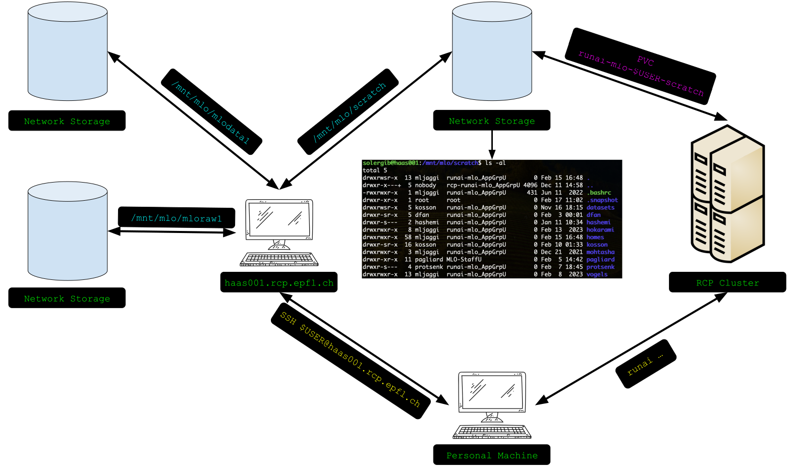
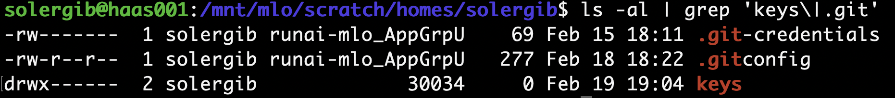

> [!IMPORTANT]
> **INFO:**
> The first part of the README includes instructions to correctly set GitHub, WANDB and Hugging Face logins, configure VSCode for remote development and RUNAI Scripts. The rest is the original README of the template.

>[!IMPORTANT]
> **INFO:**
> For this guide, we assume that access to the RCP cluster via RUNAI CLI has been configured correctly. You can consult the instructions in the [epfml/getting-started](https://github.com/epfml/getting-started?tab=readme-ov-file#minimal-basic-setup) repo, emphasizing points 3 and 5. PD: Don't forget the VPN 🛜!

# Cluster overview

From our computer, we can interact with 2 machines:

- RCP Cluster via RUNAI CLI. We don't connect directly to the server running our job, but via RUNAI, we'll initiate the job by specifying the Docker image, shared volumes, etc., and it will be assigned to a server in the RCP Cluster. Note that we can **only** mount the scratch shared volume.
- _haas001.rcp.epfl.ch_ via SSH (Gaspar Credentials). This machine has the 3 shared volumes mounted and is used solely for data transfers, creating directories, editing files, etc., and **never** for running jobs. The volumes _scratch_, _mlodata1_, and _mloraw1_ are located in `/mnt/mlo/scratch`, `/mnt/mlo/mlodata1`, and `/mnt/mlo/mloraw1`, respectively.

# Setup
In this section, we detail the steps to follow to configure the various supported services. Each and every step will be executed from _haas001.rcp.epfl.ch_.
## Create Personal Folder in Scratch
The first thing we will do is create a personal folder in the _scratch_ shared volume. To do this, we will navigate to the _homes_ folder (`/mnt/mlo/scratch/homes`) within the mounted drive and create a folder with the same name as our Gaspar username. It is in this directory where we will store our projects, API keys, Git configurations, temporary results of our experiments, etc.
```
cd /mnt/mlo/scratch/homes
mkdir $GASPAR_USER
```
## WANDB and Hugging Face Credentials
We will store the API keys within our directory in a folder that only our user will have access to. Both the wandb and Hugging Face API keys will be stored in a .txt file within this protected folder.
```
cd /mnt/mlo/scratch/homes/$GASPAR_USER
mkdir keys
cd keys
touch hf_key.txt
touch wandb_key.txt
chmod 700 -R ../keys/
```

## GitHub Credentials

To carry out the automatic login to GitHub, we will need to store our git identification (.gitconfig) and our access credentials (.git-credentials), which in this case we will do using a Personal Access Token.

To do this, we will need to set the environment variable $HOME to the personal folder we have created and activate the credential helper that will store our access credentials. 
```
export HOME=/mnt/mlo/scratch/homes/$GASPAR_USER
git config --global credential.helper store
```
Then we will configure our git identification, specifying a username and email address. 
```
git config --global user.name "FIRST_NAME LAST_NAME"

git config --global user.email "MY_NAME@example.com"
```
Finally, we will execute an action that requires our identification on GitHub to enter our access credentials and store them (e.g. Clone a private repository). When prompted for the password, we will enter the Personal Access Token that we will create in [this configuration section](https://github.com/settings/tokens) of our GitHub profile. 
```
git clone https://github.com/Meditron-DDX/meditron-ddx.git
```
As we can see, the .gitconfig and .git-credentials files have been created, the latter granting access only to the owner.


## Remote VSCode Configuration folder
We will store the configurations related to VSCode in a folder in the scratch volume so that we don't have to download them every time we start a new container.
```
mkdir /mnt/mlo/scratch/homes/$GASPAR_USER/.vscode-server
```
# Harbor Registry

The Docker images are uploaded in Harbor in the [meditron-ddx project](https://registry.rcp.epfl.ch/harbor/projects/113/repositories). Each user will have their own image since they are deprecating the use of root images.

# Launch Pod

We will start the containers in the RCP cluster using the RUNAI CLI. Below is an example to start a container mounting the storage volume, autologging to WandB, Hugging Face, and GitHub, and loading VSCode configs.
```
runai submit \
  --name meditron-basic \
  --interactive \
  --image registry.rcp.epfl.ch/meditron-ddx/solergib/basic:run-latest-solergib \
  --pvc runai-mlo-solergib-scratch:/mloscratch \
  -e NAS_HOME=/mloscratch/homes/solergib \
  -e WANDB_API_KEY_FILE_AT=/mloscratch/homes/solergib/keys/wandb_key.txt \
  -e HF_API_KEY_FILE_AT=/mloscratch/homes/solergib/keys/hf_key.txt \
  -e GITCONFIG_AT=/mloscratch/homes/solergib/.gitconfig \
  -e GIT_CREDENTIALS_AT=/mloscratch/homes/solergib/.git-credentials \
  -e VSCODE_CONFIG_AT=/mloscratch/homes/solergib/.vscode-server \
  --large-shm --host-ipc \
  -- sleep infinity
```
As we can observe, we specify the image we want to use (Remember to use the one linked to your user), mount the runai-mlo-$GASPAR_USER-scratch volume at `/mloscratch`, and via environment variables, specify our personal folder in the shared volume, the paths to the WandB and Hugging Face keys, the GitHub configuration, the directory where the VSCode configurations are located, and finally the command we will execute (In this example, we execute XXX to keep the container running). For more details on how the configurations are carried out, please refer to [installation/docker-amd64-cuda/entrypoints/entrypoint.sh](installation/docker-amd64-cuda/entrypoints/entrypoint.sh).

We can check the outputs of our container and the status of the job using the following commands respectively. 
```
runai logs meditron-basic
runai describe job meditron-basic
```
# VSCode Connection
Once we have the container running on a node of the RCP cluster, we can attach to it in VSCode. To do this, we need to have the following extensions installed:
- [Kubernetes](https://marketplace.visualstudio.com/items?itemName=ms-kubernetes-tools.vscode-kubernetes-tools)
- [Dev Containers](https://marketplace.visualstudio.com/items?itemName=ms-vscode-remote.remote-containers)
  
From the Kubernetes menu, we can see the IC and the RCP Cluster. We will enter the menu of the RCP Cluster -> Workloads -> Pods and we will see our container with a green indicator showing that it is running. Right-clicking on it will give us the option to "Attach to Visual Studio". Upon clicking, the editor will open in a new window within the container. When opening a new terminal, we will find ourselves directly in our personal folder. We can install new extensions, and they will be saved for future sessions.

# WSL VSCode Connection

For WSL setup, you will need [`kubernetes`](https://kubernetes.io/docs/tasks/tools/install-kubectl-windows/) on your Windows host because VSCode is going to look for it on the host (and not in WSL). To check that Kubernetes is correctly installed, on a Windows terminal enter the following command:
```sh
kubectl
```
On Windows, create a folder `~/.kube` and create a file `config` in this directory. Copy the [kubeconfig.yaml from the EPFML Getting started tutorial](https://github.com/epfml/getting-started/blob/main/kubeconfig.yaml) into the `config` file that you have created. 

> Note: You may already have this file in WSL from a previous installation in `~/.kube/config`. In this case you can juste enter the command `cp ~/.kube/config /mnt/c/Users/YOUR_USERNAME/.kube/config` in WSL

Then open VSCode from WSL (by entering `code` from a WSL terminal). Install this [VSCode extension](https://marketplace.visualstudio.com/items?itemName=mtsmfm.vscode-k8s-quick-attach) (in WSL). Go to View -> Command Palette (or `Ctrl+Shift+P`), search for "k8s quick attach: Quick attach k8s Pod" -> rcp-context -> runai-mlo-GASPAR -> meditron-basic-0-0 -> /mloscratch/homes/$GASPAR.

> Note: If you want to know why you can't directly use the Kubernetes extension with the WSL setup, see this [GitHub issue](https://github.com/microsoft/vscode-remote-release/issues/5849)

# More resources

- EPFL RCP [Wiki](https://wiki.rcp.epfl.ch/en/home/CaaS)
- CLAIRE RCP Cluster [Wiki](https://prickly-lip-484.notion.site/Compute-and-Storage-CLAIRE-91b4eddcc16c4a95a5ab32a83f3a8294#67d74ea2f5084867aefd917f27458837)
- runai submit [Documentation](https://docs.run.ai/v2.9/Researcher/cli-reference/runai-submit/)

# Tips

---

> [!IMPORTANT]
> **TEMPLATE TODO:**
> Replace the title below with your project title, then delete this note.

# Python Machine Learning Research Project Template

## Overview

> [!IMPORTANT]
> **TEMPLATE TODO:**
> Replace the description below with a description of your project, then delete this note.

This is a template for starting Python machine-learning research
projects with hardware acceleration at the EPFL CLAIRE lab.
It features and encourages best practices for:

- Reproducible environments on major platforms with hardware acceleration with a great development experience
  covering multiple use cases:
    - local machines, e.g., macOS (+ Apple Silicon/MPS) and Linux/Windows WSL (+ NVIDIA GPU).
    - Remote Linux servers with GPUs, e.g., VMs on cloud providers and IC and RCP HaaS at EPFL.
    - Managed clusters supporting OCI containers with GPUs, e.g., the EPFL IC and RCP Run:ai (Kubernetes) clusters.
- Python project packaging following the
  [PyPA packaging guidelines](https://packaging.python.org/en/latest/tutorials/packaging-projects/) to avoid hacky
  imports.
- Experiment management, tracking, and sharing with [Hydra](https://hydra.cc/)
  and [Weights & Biases](https://wandb.ai/site).
- Code quality with [pre-commit](https://pre-commit.com) hooks.

Thanks to its focus on reproducibility, this template can readily be used by other labs at EPFL and beyond.
It makes collaboration and open-sourcing your work straightforward, avoiding setup issues and
[maximizing its impact](https://medium.com/paperswithcode/ml-code-completeness-checklist-e9127b168501#a826).
The practices in this template earned its authors
an [Outstanding Paper (Honorable Mention)](https://openreview.net/forum?id=E0qO5dI5aEn)
at the [ML Reproducibility Challenge 2022](https://paperswithcode.com/rc2022).

A project made with the template would look like [this](https://github.com/skandermoalla/pytoych-benchmark).

Follow this README to get started with the template.

For a brief discussion of the template's design choices and a Q&A check `template/README.md` file.

## Getting started with the template

> [!IMPORTANT]
> **TEMPLATE TODO:**
> Delete this whole section when you're done with the template getting started.

Click on the `Use this template` GitHub button to create a new GitHub repository from this template.
Give it a lowercase hyphen-separated name (we will refer to this name as `PROJECT_NAME`),
then follow the instructions below to set up your project.
You can also give your GitHub repo another name format if you prefer, but for the template, you will have to pick
a `PROJECT_NAME` as well.
It's useful to commit after some checkpoints to be able to go back if you make a mistake.
Some instructions will send you to different READMEs in the template that will compile nicely together in the end.
Remember to get back to this root one after finishing each step.

1. Clone the repo with destination `PROJECT_NAME`.
    - If you plan to develop on your local computer, clone it there.
    - If you plan to develop on your remote server (with direct access over say SSH, e.g. EPFL HaaS), clone it there.
    - If you plan to develop or deploy on a managed cluster (e.g., EPFL Run:ai clusters), clone on your local machine.
      (Docker allows cross-platform builds with emulation, but it can be slow.
      We would recommend that your local machine is of the same platform as the cluster (e.g. `amd64`, `arm64`),
      or that you have access to a remote Docker engine running on the same platform of the cluster.)
    ```
    git clone <URL/SSH> PROJECT_NAME
    ```
   We will refer to the absolute path to the root of the repository as `PROJECT_ROOT`.

2. Fill the template variables in `template/template-variables.env` by
   editing the ones with the `$NEW_` prefix, then run the script
   ```bash
   ./template/change-project-name.sh
   ```
   Commit.
3. Initialize the pre-commit hooks as described in the [contributing](#contributing) section.
   Update them to their latest version with `pre-commit autoupdate`.
   Commit.
4. Edit the `LICENSE` file.
   Or delete it and remember to add one when open-sourcing your code.
   [(Some help here).](https://docs.github.com/en/repositories/managing-your-repositorys-settings-and-features/customizing-your-repository/licensing-a-repository)
   A simple change if you're fine with the MIT license is to replace the `2022 Skander Moalla` with your year and name.
   Commit.
5. Set up and edit the development environment instructions for the methods and platforms you will use and support.
   Each method supports a group of use cases:
    - **Docker**.
      This is the preferred method to run on Linux machines (e.g. EPFL HaaS servers),
      Windows machines with WSL, clusters running OCI-compliant containers like the EPFL Run:ai (Kubernetes) clusters,
      and other cloud services.
      (A tutorial to deploy on Run:ai clusters is provided.)

      The environment is shipped as a Linux Docker image, ensuring the highest level of reproducibility.
      You are free to choose the architecture you want to build the image for,
      e.g. `amd64` or `arm64`.
      By default, this image is set up for `amd64`.
      You are also free to choose the hardware acceleration you want to support.
      By default, this template allows local deployment with NVIDIA GPUs and can extend
      [NGC images](https://catalog.ngc.nvidia.com/containers).
      The template currently supports only one architecture and hardware acceleration combo at a time.
      It's up to you to extend it.

      Go to `installation/docker-amd64-cuda/README.md` for the setup.
      Come back here after following the instructions there.

    - **Conda**.
      The environment is shipped as a conda environment file.
      The level of reproducibility is lower than with Docker, as system dependencies will not be strictly recorded.
      The only reason this option is available is to leverage hardware acceleration of platforms not compatible with
      OCI containers, in particular, [MPS](https://developer.apple.com/metal/pytorch/)
      which is [not supported](https://github.com/pytorch/pytorch/issues/81224)
      on Docker for macOS with Apple Silicon.

      By default, this option is set up for `osx-arm64` to run on macOS with Apple Silicon.
      This installation method could also be used if you want to settle for a lower level of reproducibility
      and do not need to run on container clusters.
      In that case, you might support another platform, e.g. `amd64`, and hardware acceleration, e.g., NVIDIA GPUs.
      The template currently supports only one architecture and hardware acceleration combo at a time.
      It's up to you to extend it.

      Go to `installation/conda-osx-arm64-mps/README.md` for the setup.
      Come back here after following the instructions there.

   Delete the installation directory for the installation method you don't use.

   Naturally, results will be reproducible on machines with the same architecture using the same installation method,
   but not necessarily across architectures and installation methods.
   This is because dependency versions may vary across platforms.
   Try to keep the dependency versions as close as possible to ensure the replicability of your results.

6. Edit this `README.md` file.
    1. Edit the title with the name of your project.
       Replace the [Overview](#overview) section with a description of your project.
    2. Delete the installation options you don't support in
       the [Getting Started](#getting-started) section.
    3. Have a look at the last paragraph below describing how to keep your project in good shape,
       then delete this getting started, to only keep the project [Getting Started](#getting-started) section.

You're off to a good start! If you made it here, give the template a star!
Here are a few tips for keeping your project in good shape.

- Keep this README up to date.
  Fill in the rest of the sections after the Getting Started section when releasing your project.
  We give a structure and some templates for those.

  If you use datasets, follow `data/README.md` to set them and write the instructions
  for the subsequent users there.
  Otherwise, delete the [data](#data) section.
- Remember to pin your dependencies whenever you install new ones.
  This is well described in the Maintaining the environment section of the installation instructions.
- Keep your `reproducibility-scripts/` directory up to date.
  Commit it regularly and run your jobs with those scripts.
  More on this in the [reproducibility](#reproducing-our-results) section.
- Maintain good commit hooks. More on this in the [Contributing](#contributing) section.
- Have a look at the [ML Code Completeness Checklist](https://github.com/paperswithcode/releasing-research-code).
  This template facilitates meeting all the checklist items, with a different design.
  Have a look at the checklist when you ship your project.

## Getting Started

### Code and development environment

> [!IMPORTANT]
> **TEMPLATE TODO**:
> Update the installation methods and platforms you support, delete the rest, and delete this note.
> I.e. keep either Docker or Conda, or both and
> 1. Change the platform for each option and its description to the one(s) you support
>    e.g., for Docker amd64, arm64, etc., and for conda osx-arm64, linux-amd64, etc.
> 2. Change the hardware acceleration options to the one(s) you support
>    e.g., for Docker NVIDIA GPUs, etc.
> 3. Specify the hardware on which you ran your experiments (e.g., type of CPU/GPU and size of memory) and
>    the minimum hardware required to run your code if applicable (e.g., NVIDIA GPU with 80GB of memory).

We support the following methods and platforms for installing the project dependencies and running the code.

- **Docker/OCI-container for AMD64 machines (+ NVIDIA GPUs)**:
  This option works for machines with AMD64 CPUs and NVIDIA GPUs.
  E.g. Linux machines (EPFL HaaS servers, VMs on cloud providers),
  Windows machines with WSL, and clusters running OCI-compliant containers,
  like the EPFL Run:ai (Kubernetes) clusters.

  Follow the instructions in `installation/docker-amd64-cuda/README.md` to install the environment
  then get back here for the rest of the instructions to run the experiments.

  We ran our experiments on TODO: FILL IN THE HARDWARE YOU USED.
  To run them, you should have at least TODO: FILL IN THE MINIMUM HARDWARE REQS IF APPLICABLE.

- **Conda for osx-arm64**
  This option works for macOS machines with Apple Silicon and can leverage MPS acceleration.

  Follow the instructions in `installation/conda-osx-arm64-mps/README.md` to install the environment
  then get back here for the rest of the instructions to run the experiments.

  We ran our experiments on TODO: FILL IN THE HARDWARE YOU USED.
  To run them, you should have at least TODO: FILL IN THE MINIMUM HARDWARE REQS IF APPLICABLE.

### Data

> [!IMPORTANT]
> **TEMPLATE TODO**:
> Fill `data/README.md` or delete this section, then delete this note.

Refer to `data/README.md`.

### Logging and tracking experiments

We use [Weights & Biases](https://wandb.ai/site) to log and track our experiments.
If you're logged in, your default entity will be used (a fixed entity is not set in the config),
and you can set another entity with the `WANDB_ENTITY` environment variable.
Otherwise, the runs will be anonymous (you don't need to be logged in).

## Reproduction and Experimentation

### Reproducing our results

> [!IMPORTANT]
> **TEMPLATE TODO**:
> Keep these scripts up to date and run your experiments using them. Delete this note when shipping.

We provide scripts to reproduce our work in the `reproducibility-scripts/` directory.
It has a README at its root describing which scripts reproduce which experiments.

### Experiment with different configurations

The default configuration for each script is stored in the `configs/` directory.
They are managed by [Hydra](https://hydra.cc/docs/intro/).
You can experiment with different configurations by passing the relevant arguments.
You can get examples of how to do so in the `reproducibility-scripts/` directory.

### Using trained models and experimenting with results

> [!IMPORTANT]
> **TEMPLATE TODO**:
> Do provide the runs and trained models or update/delete this section, then delete this note.

We share our Weights and Biases runs in [this W&B project](https://wandb.ai/claire-labo/transformers-in-rcp).

Moreover, we make our trained models available.
You can follow the instructions in `outputs/README.md` to download and use them.

## Repository structure

> [!IMPORTANT]
> **TEMPLATE TODO**:
> Provide a quick overview of the main files in the repo for users to understand your code,
> then delete this note.

Below, we give a description of the main files and directories in this repository.

```
 └─── src/                              # Source code.
    └── template_package_name           # Our package.
        ├── configs/                    # Hydra configuration files.
        └── template_experiment.py      # A template experiment.
```

## Contributing

We use [`pre-commit`](https://pre-commit.com) hooks to ensure high-quality code.
Make sure it's installed on the system where you're developing
(it is in the dependencies of the project, but you may be editing the code from outside the development environment.
If you have conda you can install it in your base environment, otherwise, you can install it with `brew`).
Install the pre-commit hooks with

```bash
# When in the PROJECT_ROOT.
pre-commit install --install-hooks
```

Then every time you commit, the pre-commit hooks will be triggered.
You can also trigger them manually with:

```bash
pre-commit run --all-files
```
